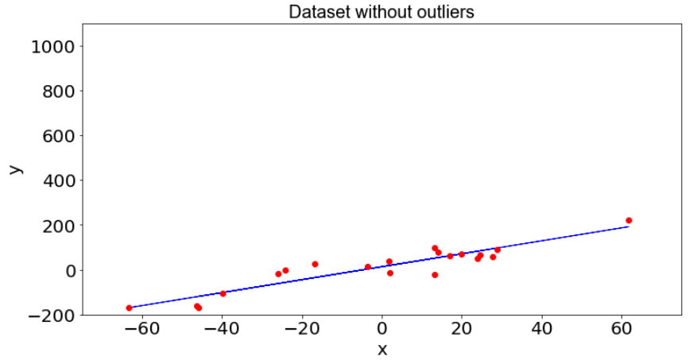
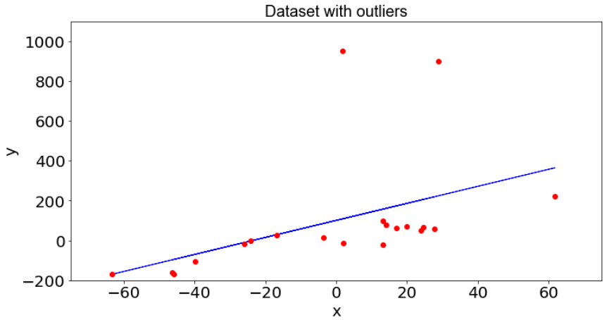

# Outlier - The point outside the curve
Short study on outliers: types, causes, detection process, effects on regression models, treatment. 

## Table of Contents
* [General information](#general-information)
* [Technologies Used](#technologies-used)
* [Effect of outliers](#Effect-of-outliers)
* [Screenshots](#screenshots)
* [Setup](#setup)
* [Usage](#usage)
* [Project Status](#project-status)
* [Room for Improvement](#room-for-improvement)
* [Acknowledgements](#acknowledgements)
* [Contact](#contact)
<!-- * [License](#license) -->

## General Information
- This small study is associated with an article published on the blog [Ensina-ai](https://medium.com/ensina-ai). The article can be found [here](https://medium.com/ensina-ai/outlier-o-ponto-fora-da-curva-1f28f3d9c23).

- The work presents the types of outliers and their main causes, their effects on machine learning models, detection method and treatment of anomalous values found.

## Technologies Used
- Python - version 3.8.8

## Effect of outliers
* Effect of the presence of dataset outliers
  * Regression on dataset without outliers:
  
  * Regression on dataset with outliers:
  

## Screenshots

<!-- If you have screenshots you'd like to share, include them here. -->

## Setup
What are the project requirements/dependencies? Where are they listed? A requirements.txt or a Pipfile.lock file perhaps? Where is it located?

Proceed to describe how to install / setup one's local environment / get started with the project.

## Usage
How does one go about using it?
Provide various use cases and code examples here.

`write-your-code-here`

## Project Status
Project is: _in progress_ / _complete_ / _no longer being worked on_. If you are no longer working on it, provide reasons why.

## Room for Improvement
Include areas you believe need improvement / could be improved. Also add TODOs for future development.

Room for improvement:
- Improvement to be done 1
- Improvement to be done 2

To do:
- Feature to be added 1
- Feature to be added 2

## Acknowledgements
Give credit here.
- This project was inspired by...
- This project was based on [this tutorial](https://www.example.com).
- Many thanks to...

## Contact
Created by [@flynerdpl](https://www.flynerd.pl/) - feel free to contact me!

<!-- Optional -->
<!-- ## License -->
<!-- This project is open source and available under the [... License](). -->

<!-- You don't have to include all sections - just the one's relevant to your project -->
